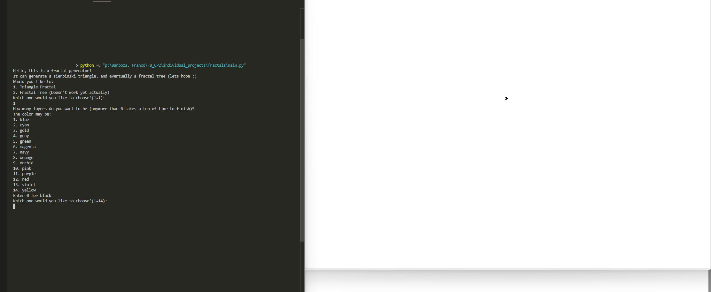
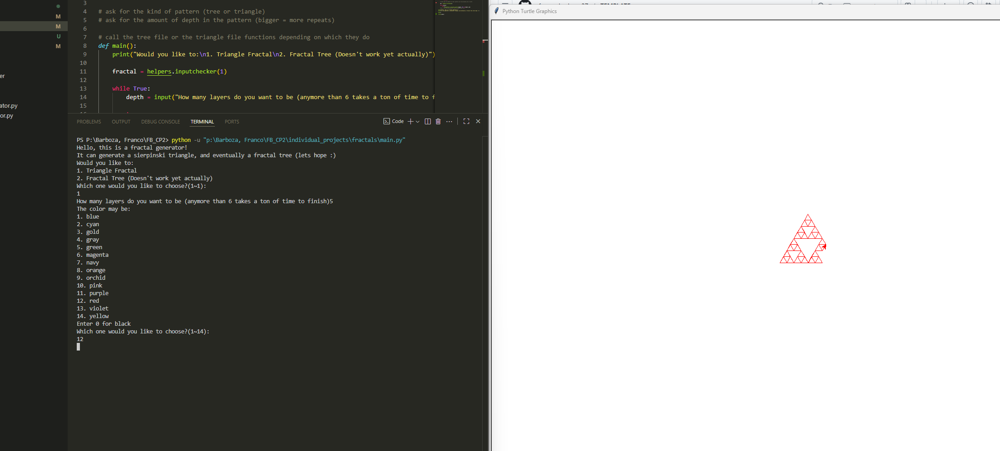

# FRACTAL GENERATOR
***

***
PARAGRAPH description of the program

## Steps for use
***
1. Go to the main.py file
2. Press the run button
3. input fractal type
4. choose depth
5. choose color
6. Watch it work!

## List of KEY features
***
- Lets you choose the depth and color of a sierpinski triangle
    - depth is basically the amount of small triangles

## Installation Instructions
***
Not applicable

## Contributors
- Gummy (franco-barboza27)

## Licence information
- the school (?)
- otherwise N/A

## Contributions
- If you wanted you could add the v-tree generator