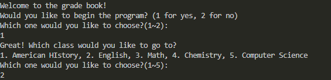

# Name of the project
***

***
This is a GRADE BOOK program! It allows you to see and manage the grades of students in your class! Make teaching easier with this awesome tool that totally isn't TEMU Canvas! Have FUN!!!

## Steps for use
***
1. Run code in MAIN file
2. Select a class the from the choices given
3. If first use, create new students
4. Manage your students!

## List of KEY features
***
- Allows you to save student grades to an individual database for five different classes.
    - You can see class statistics and other acts
- Convert percentages
    - Allows you to see letter grade
- Grade update
    - allows you to accurately calculate someone's grade in a weightless system.

## Installation Instructions
***
1. Copy the code from github
2. Press the "run" button

## Contributors
- Gummy

## Licence information
- UCAS

## Contributions
- Come up with new school classes
- Create a school class
- Add visual effects