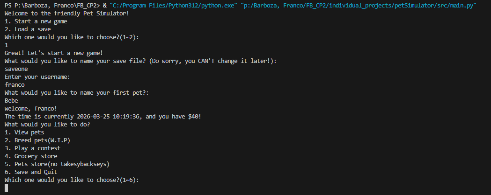

# Simple Pet Sim
***

***
This is a simple pet simulator. You play as a person who is trying to keep their pets alive. To do so, you have to make money via competitions and train your pets! If you don't maintain enough money and food, or son't play a lot, your pets will die!

## Steps for use
***
1. First, create a new save!
2. Then, name yourself, and your pet!
3. Explore the menus, make money, and don't neglect your pets!

## List of KEY features
***
- Multiple pets are able to be kept
    - You can have rabbits, dogs, and cats!
- You can play with your pets! :joy:
    - Basically, you can interact with all your pets
- Manage your animals!
    - If you don't play enough, they'll die rather quickly!

## Installation Instructions
***
To install, simply go to github, copy the code/open a code space, and then run it in a python TERMINAL

## Contributors
- Gummy

## Licence information
- UCAS

## Contributions
- You can add more pet interactions
- fix the load save.
- make more pet types
- add flavor text
- make a pet breeding functionality